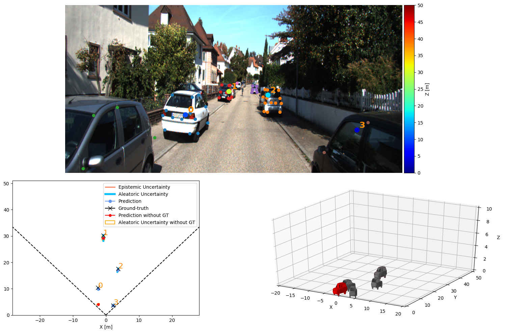
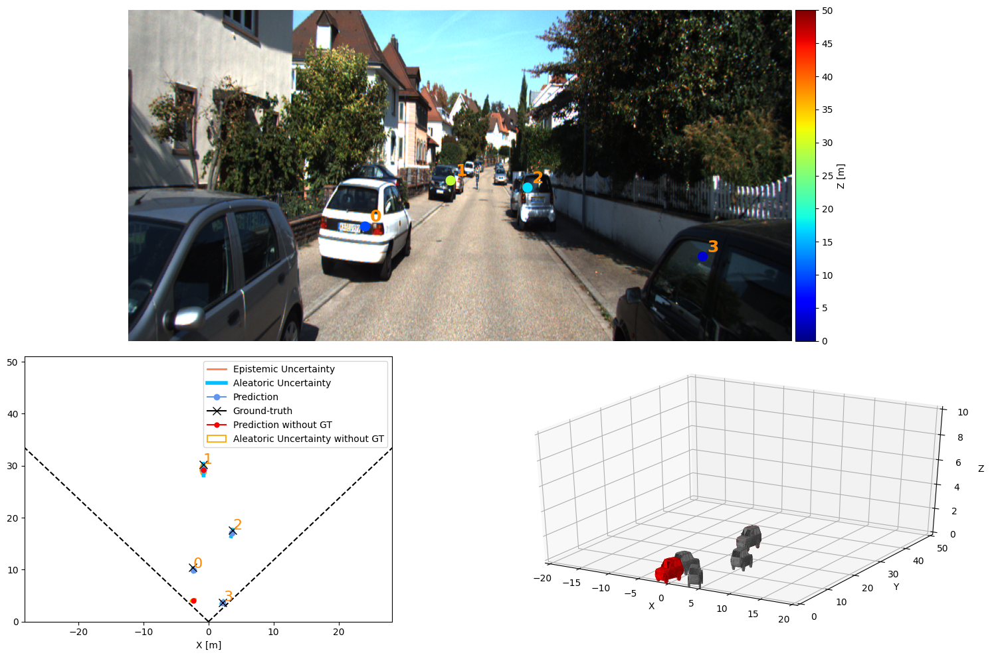
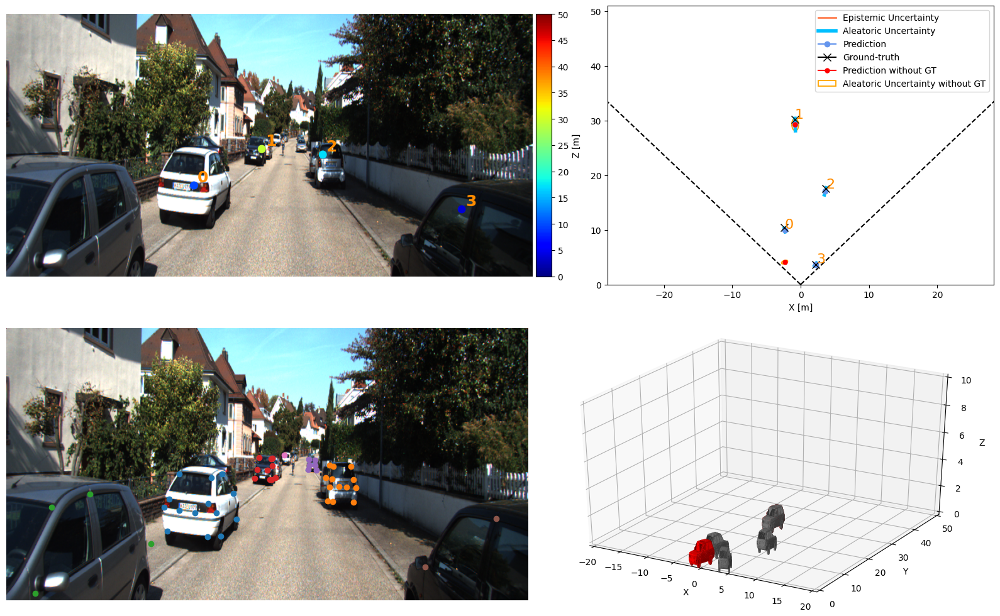

# Perceiving Humans in 3D

This repository contains the code for three research projects:

1. **MonStereo: When Monocular and Stereo Meet at the Tail of 3D Human Localization**   
[README](https://github.com/vita-epfl/monstereo/tree/master/docs/MonStereo.md) & [Article](https://arxiv.org/abs/2008.10913)

    

2.  **Perceiving Humans: from Monocular 3D Localization to Social Distancing**         
 [README](https://github.com/vita-epfl/monstereo/tree/master/docs/SocialDistancing.md) & [Article](https://arxiv.org/abs/2009.00984)
 
    
 
3.  **MonoLoco: Monocular 3D Pedestrian Localization and Uncertainty Estimation**  (Improved!)       
[README](https://github.com/vita-epfl/monstereo/tree/master/docs/MonoLoco.md) & [Article](https://arxiv.org/abs/1906.06059)  & [Original Repo](https://github.com/vita-epfl/monoloco)

    


**Disclaimer**

This project was modified by Maxime Bonnesoeur in the course of his Master project performed at the EPFL, Switzerland.

The original fonctionalities of the original implementation are still intact. The generic commands used with monstereo are still the same. For a detailed explanations of such commands, I would ask you to refer to the original repo. This repo only provides additional functionalities described below.

The contributions are the followings:

* Compatibility of code to work with vehicles for the KITTI and the apolloscape dataset.

* Implementation of a new network as backbone using self-attention mechanisms.

* Implementation of a dropout on the keypoints during the preprocessing step

* Added compatibility for the apolloscape dataset. Creation of a toolbox and of a preprocessing step to extract data from the dataset.

* Option to estimate the 3D projection of the 2D keypoints for the vehicles on the apolloscape dataset.

* Option to process the instances at the "scene" level. The objective there is to leverage on the interactions between the instances in an image to improve our predictions.

* New options for visualizations for vehicles.

* Creation of a bash script for automated preprocessing, training and evaluation of the models.

## Vehicles

The vehicles are now compatible for monstereo for both the KITTI and apolloscape dataset. 
It accept as inputs a set of 24 keypoints in the formatting imposed by openpifpaf.

To call the functions while working with vehicles, simply add ```--vehicles``` at the end of your command such as in :

```python3 -m  monstereo.run train --epochs 80 --lr 0.001 --joints data/arrays/joints-kitti-vehicles-transformer-210110-092355.json --hidden_size 1024 --monocular --vehicles --dataset kitti --save```

This is true dor every regular commands that you are using monstereo with.

## Self-attention usage

Self-attention is primarly used to improve the performances when the model is faced with severely occluded instances.

To use the self-attention mechanism, the tag ```--transformer``` needs to be added at the end of your command such as in :

```python3 -m monstereo.run eval --dir_ann data/kitti-pifpaf/annotations_car --model_mono data/models/ms-210209-202327-vehicles-transformer-kitti.pkl --hidden_size 1024 --vehicles --generate --save --verbose --transformer```


This is true dor every regular commands that you are using monstereo with (predict, train, ...).

## Dropout keypoints

Randomly occlude keypoints with a probability a with a between 0 and 1. This is a data augmentation technique that will add the newly pruned keypoints dataset to the original dataset


```python3 -m  monstereo.run prep --dir_ann [annotation folder] --monocular --vehicles --dataset kitti --dropout 0.3 --confidence --kps_3d```


## Apolloscape dataset

The apolloscape dataset can now be used for the train of our models. To preprocess the apolloscape dataset, input the following command: 

```python3 -m  monstereo.run prep --dir_ann data/apollo-pifpaf/annotations_loose --monocular --vehicles --dataset apolloscape --dropout 0.3 --confidence --kps_3d```


To train the apolloscape network, input the following kind of command (precise apolloscape in dataset):

``` python3 -m  monstereo.run train --epochs 80 --lr 0.001 --joints [Name fo your joints file] --hidden_size 1024 --monocular --vehicles --dataset apolloscape --save```


**Warning** : the apolloscape dataset only contains vehicles annotations. Hence, the ´´´--vehicles´´´tag is mandatory each time that the apolloscape network is being used.

## 3D keypoints projection

With the apolloscape dataset only, the network can be trained to predict the depth component of each visible 2D keypoint predicted with monstereo.

To do so, add the ```--kps_3d``` tag within your command line during training, dataset preparation and prediction such as :

```python3 -m  monstereo.run prep --dir_ann data/apollo-pifpaf/annotations_loose --monocular --vehicles --dataset apolloscape --dropout 0.3 --confidence --kps_3d```

## Scene disposition

To process the inputs at the "scene" level, just add the ```--scene_disp``` within the command line such as with :

```python3 -m monstereo.run train --epochs 80 --lr 0.001 --joints [Name fo your joints file] --hidden_size 1024 --monocular --vehicles --dataset kitti --transformer --scene_disp --save```

This tag is only useful during training, evaluation and prediction time. It is not needed during the preprocessing step.

More options to tune the scene disposition are available at the beginning of the file :  *network/architecture.py*
## Visualization options for vehicles

For the prediction step, several new visualization are now available for the vehicle case. Those options are enabled by changing the parameter ```--output_types```.

An example of each visualization is given below :


```--output_types combined_kps```:




```--output_types combined_nkps```:



```--output_types combined_3d```:



## Script for preprocessing, training and evaluation

A tuneable script *train_eval.sh* allows for an automation of the preprocessing, training and evaluation phase for both the apolloscape and KITTI dataset. This script needs to be used in coordination with a master script such as *train_eval_simp.sh*.

All the details about the usage of  those scripts are present inside them.